# 📡🌐 DHCP Redundancy with Failover in Office Network

## Table of Contents
1.  [📘 Project Overview](#-project-overview)
2.  [🎯 Project Objective](#-project-objective)
3.  [🌐 Network Topology](#-network-topology)
4.  [🗂️ Device Interface Table](#-device-interface-table)
5.  [📝 IP Addressing Table](#-ip-addressing-table)
6.  [🔧 Lab Steps](#-lab-steps)
7.  [💻 Device Configuration](#-device-configuration)
    - [🔀 Switch 1](#-switch-1)  
    - [🔀 Switch 2](#-switch-2)  
    - [🚦 Router 1](#-router-1)  
    - [📡 Server 1 DHCP POOL](#-server-1-dhcp-pool)  
    - [📡 Server 2 DHCP POOL](#-server-2-dhcp-pool)   
8.  [🧰 Packet Tracer Limitations](#-packet-tracer-limitations)
9.  [✅ Verification](#-verification)
10. [⚡ How to Run Lab](#-how-to-run-lab)
11. [📂 -Folder Structure](#folder-structure)
12. [🎓 Learning Outcomes](#-learning-outcomes)
13. [ℹ️ Repository Info](#-repository-info)
---

## 📘 Project Overview

This lab demonstrates DHCP redundancy in a small office network. Two DHCP servers provide IP addresses to PCs across VLANs. 
If the primary DHCP server fails, the backup server ensures continued IP availability. 
The lab also demonstrates router-on-a-stick configuration for inter-VLAN communication.

> Note: 
Due to Packet Tracer simulation limitations, DHCP may not function correctly in multi-VLAN setups with router-on-a-stick. 
Manual IP assignment was used for demonstration purposes to verify the lab objectives, including inter-VLAN communication and DHCP failover.

---

## 🎯 Project Objective

- Configure DHCP pools on a primary server for VLAN10 and VLAN20.
- Configure a backup DHCP server to provide failover.
- Verify inter-VLAN communication using a router-on-a-stick.
- Demonstrate DHCP failover scenario.
- Document Packet Tracer limitations and provide workarounds.

---

## 🌐 Network Topology

- **Devices:** 2 DHCP Servers, 1 Router (R1), 2 Switches (SW1, SW2), 6 PCs  
- **VLAN Assignment:**  
  - VLAN10: PC1, PC2, PC5  
  - VLAN20: PC3, PC4, PC6  

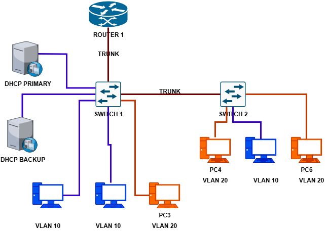

---

## 🗂️ Device Interface Table

| Device   | Interface | Connected Device| Connected Interface| VLAN / Notes                 |
|----------|-----------|-----------------|-------------------|-------------------------------|
| Router   | G0/0      | Switch 1        | Fa0/24            | Trunk / VLAN 10 & 20          |
| Switch1  | Fa0/1     | PC1             | NIC               | VLAN10                        |
| Switch1  | Fa0/2     | PC2             | NIC               | VLAN10                        |
| Switch1  | Fa0/3     | PC3             | NIC               | VLAN20                        |
| Switch1  | Fa0/4     | DHCP Server1    | NIC               | VLAN10                        |
| Switch1  | Fa0/5     | DHCP Server2    | NIC               | VLAN10 (backup)               |
| Switch1  | Fa0/23    | Switch2         | Fa0/23            | Trunk / inter-switch link     |
| Switch1  | Fa0/24    | Router G0/0     | G0/0              | Trunk / VLAN 10 & 20          |
| Switch2  | Fa0/1     | PC4             | NIC               | VLAN20                        |
| Switch2  | Fa0/2     | PC5             | NIC               | VLAN10                        |
| Switch2  | Fa0/3     | PC6             | NIC               | VLAN20                        |
| Switch2  | Fa0/23    | Switch1         | Fa0/23            | Trunk / inter-switch link     |

---

## 📝 IP Addressing Table

| Device / VLAN | IP Address (Planned DHCP Pool) | Subnet Mask     | Default Gateway| Notes / Verification Workaround         |
|---------------|--------------------------------|-----------------|----------------|-----------------------------------------|
| PC1 (VLAN10)  | 192.168.10.50–100 (DHCP)       | 255.255.255.0   | 192.168.10.1   | Manual IP assigned due to PT limitation |
| PC2 (VLAN10)  | 192.168.10.50–100 (DHCP)       | 255.255.255.0   | 192.168.10.1   | Manual IP assigned for verification     |
| PC5 (VLAN10)  | 192.168.10.50–100 (DHCP)       | 255.255.255.0   | 192.168.10.1   | Manual IP assigned for verification     |
| PC3 (VLAN20)  | 192.168.20.50–100 (DHCP)       | 255.255.255.0   | 192.168.20.1   | Manual IP assigned for verification     |
| PC4 (VLAN20)  | 192.168.20.50–100 (DHCP)       | 255.255.255.0   | 192.168.20.1   | Manual IP assigned for verification     |
| PC6 (VLAN20)  | 192.168.20.50–100 (DHCP)       | 255.255.255.0   | 192.168.20.1   | Manual IP assigned for verification     |
| Router G0/0.10| 192.168.10.1                   | 255.255.255.0   | -              | VLAN10 SVI for DHCP gateway             |
| Router G0/0.20| 192.168.20.1                   | 255.255.255.0   | -              | VLAN20 SVI for DHCP gateway             |
| Server1 VLAN10| 192.168.10.10                  | 255.255.255.0   | 192.168.10.1   | Primary DHCP server                     |
| Server2 VLAN10| 192.168.10.11                  | 255.255.255.0   | 192.168.10.1   | Backup DHCP server, used for failover   |

> Note: Manual IP assignment was used for verification due to Packet Tracer DHCP limitations.

---

## 🔧 Lab Steps

1. Configure VLANs on SW1 and SW2.  
2. Configure router-on-a-stick (R1 subinterfaces) for VLAN10 & VLAN20.  
3. Configure primary DHCP server with pools for VLAN10 and VLAN20.  
4. Configure backup DHCP server with pools for VLAN10 and VLAN20 (keep OFF initially).  
5. Connect PCs to respective VLAN ports.  
6. Assign trunk links between switches and router.  
7. Verify inter-VLAN routing and DHCP assignment (manual IP assignment if PT fails).  
8. Simulate failover: turn off Server1, turn on Server2, assign backup IPs, test connectivity.  

---

## 💻 Device Configuration

### 🔀 Switch 1 

```text
vlan 10
name HR
exit
vlan 20
name IT
exit
```
! Assign access ports
```text
interface fa0/1
switchport mode access
switchport access vlan 10
description PC1
exit
```

[View Full Configuration File →](configs/switch-config/sw1.cfg)

---
### 🔀 Switch 2

```text
vlan 10
name HR
exit
vlan 20
name IT
exit
```
! Access ports for PCs
```text
interface fa0/1
description PC4
switchport mode access
switchport access vlan 20
no shutdown
exit
```
[View Full Configuration File →](config/switch-config/sw2.cfg)

---
### 🚦 Router 1

```text
interface GigabitEthernet0/0.10
description VLAN10 - HR
encapsulation dot1Q 10
ip address 192.168.10.1 255.255.255.0
no shutdown
exit
```
[View Full Configuration File →](configs/router-config/r1.cfg)

---
### 📡 Server 1 DHCP POOL

**Primary Server**

**Create Pool VLAN10-HR**
- Default Gateway: 192.168.10.1
- Start IP: 192.168.10.50
- End IP: 192.168.10.100
- Subnet Mask: 255.255.255.0

Refer to full files: 
- [Server Configs →](configs/server-config/server1.txt)
---
### 📡 Server 2 DHCP POOL

**Backup Server**

Refer to full files: 
- [Server Configs →](configs/server-config/server2.txt)

---

## 🧰 Packet Tracer Limitations

- DHCP in multi-VLAN topologies may:  

  1. Assign IP outside the DHCP pool  

  2. Fail to assign default gateway and DNS  

**Summary:** 

The DHCP issue occurs because Router-on-a-Stick with multiple VLANs in Packet Tracer cannot reliably forward DHCP requests/responses. 
Manual IP assignment was used to complete verification steps and demonstrate failover.

---
## ✅ Verification

### Topology Overview

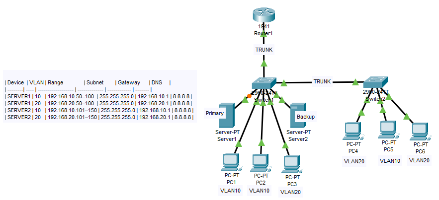


## Step 1: 🔍 Verify VLANs
```text
SW1> show vlan brief
SW2> show vlan brief
```
**SW1**

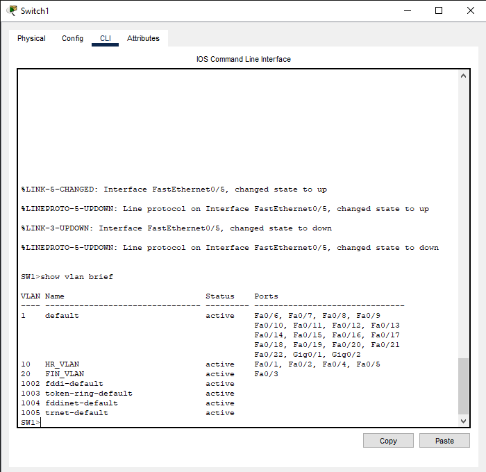

**SW2**

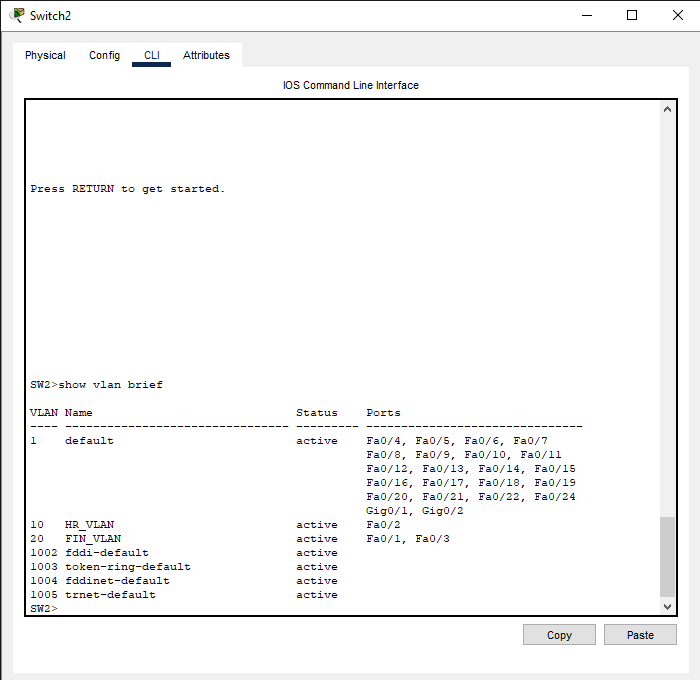

## Step 2: 🔗 Verify Trunks
```text
SW1> show interfaces trunk
SW2> show interfaces trunk
```
**SW1**

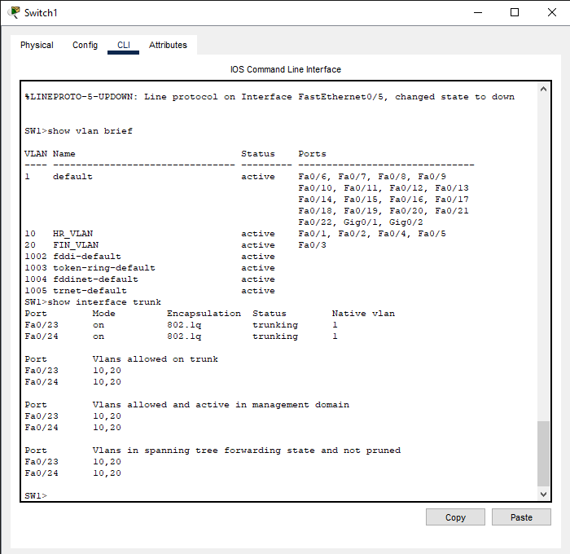

**SW2**

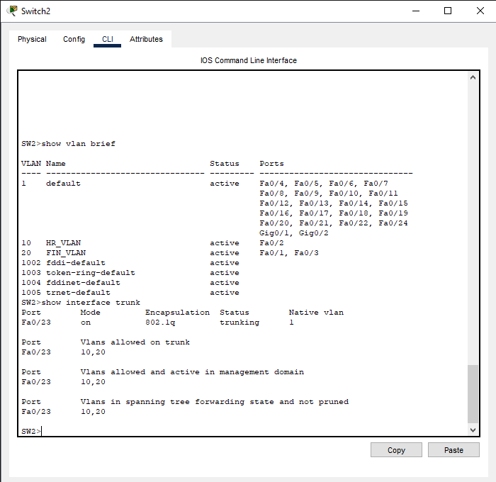

## Step 3: 🚦 Verify Router Subinterfaces
```text
R1> show ip interface brief
```
**R1** 

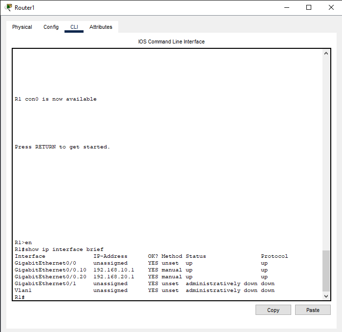

## Step 4: 📡 Verify DHCP Assignment (Manual Workaround)

> Note: 
- PCs are intended to receive IPs dynamically from DHCP. 
- Due to Packet Tracer limitation with multi-VLAN DHCP (router-on-a-stick), DHCP may fail to assign the correct IP, gateway, or DNS. 
- Manual IPs within the DHCP pool were used for verification.

| PC  | IP Address     | Subnet Mask    | Default Gateway |
|-----|----------------|----------------|---------------- |
| PC1 | 192.168.10.50  | 255.255.255.0  | 192.168.10.1    |
| PC3 | 192.168.20.50  | 255.255.255.0  | 192.168.20.1    |

**PC1**

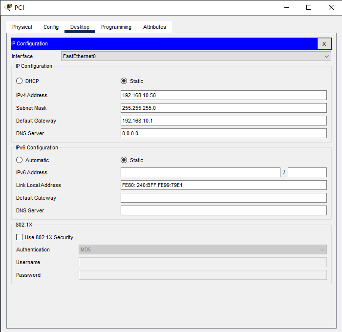

**PC3**

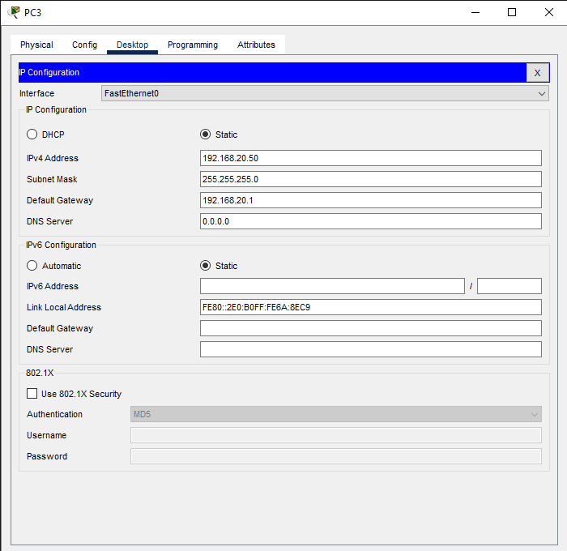

## Step 5: 🔌 Verify Inter-VLAN Connectivity
```text
PC1> ping 192.168.20.50
PC3> ping 192.168.10.50
```

**PC1**

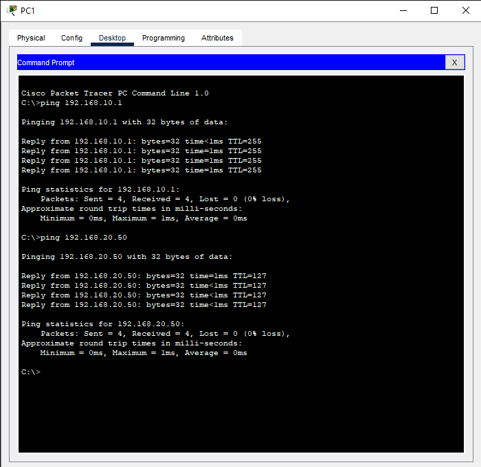

**PC3**

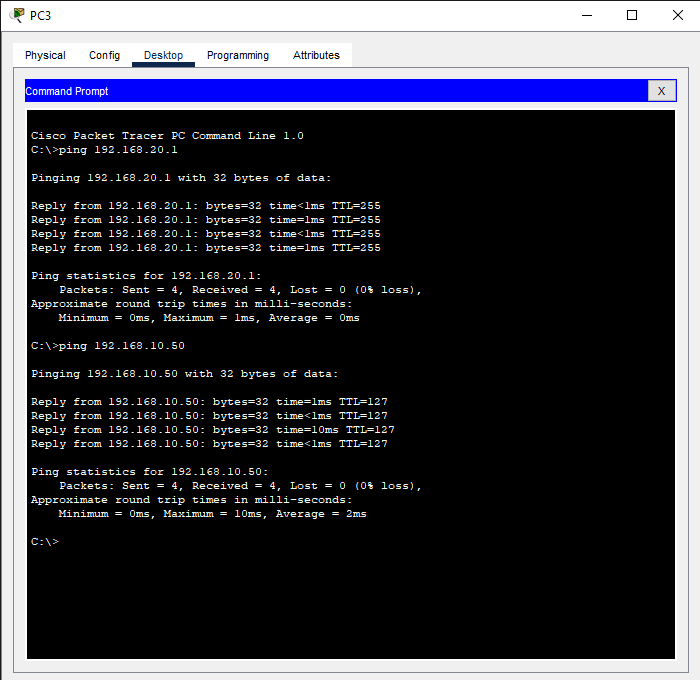

## Step 6: 📡 Test DHCP Failover

- Turn Server1 OFF, Server2 ON.
- Assign backup IPs manually (Packet Tracer limitation)
```text
PC1: 192.168.10.101
PC3: 192.168.20.101
```

**PC1**


**PC3**

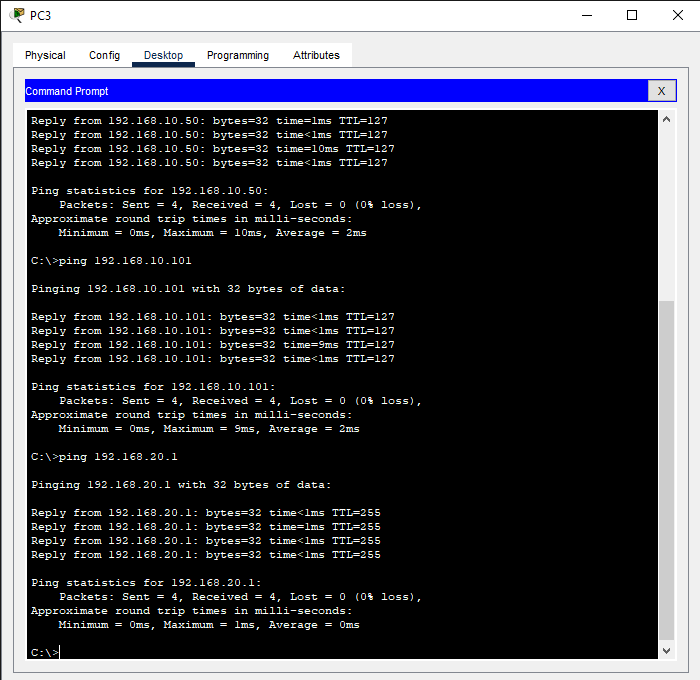

- Verify connectivity to gateway:
```text
PC1> ping 192.168.10.1
PC3> ping 192.168.20.1
```

**PC1**

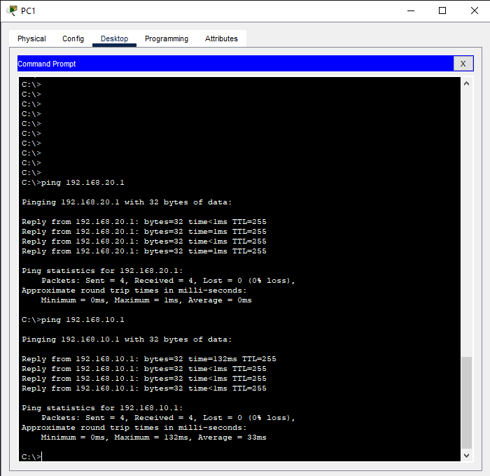

**PC3**

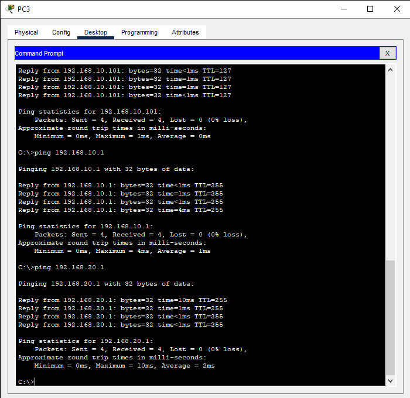

## Step 7: 🔍 Test Inter-VLAN after Failover
```text
PC1> ping 192.168.20.101
PC3> ping 192.168.10.101
```
**PC1**

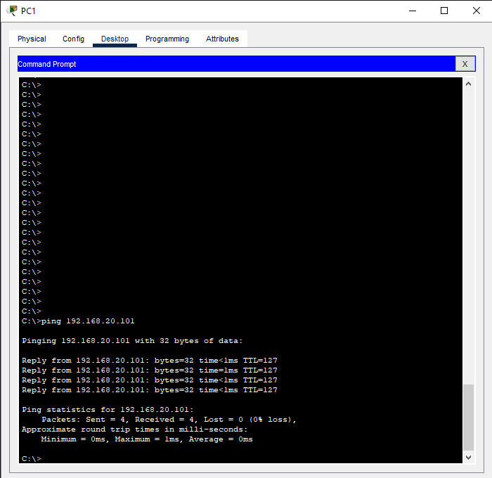

**PC2**

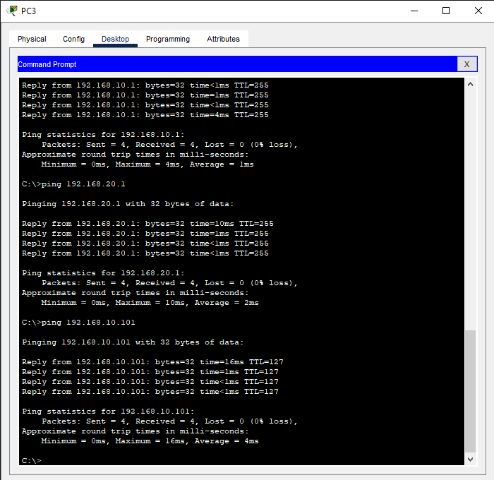

---
## ⚡ How to Run Lab

1. Download or clone the repository.

2. Open **Packet Tracer** and load the lab file:
   lab_file/dhcp-redundancy-with-Failover-in-Office-Network.pkt

3. Load device configurations from the configs/ folder if needed.

4. Start all devices and verify VLANs, trunk links, and inter-VLAN routing.

5. Test DHCP assignment for PCs (manual IPs may be needed due to Packet Tracer limitations).

6. Simulate failover by turning off **Server1** and assigning backup IPs via **Server2.**

7. Verify connectivity and inter-VLAN communication post-failover.

---

## Folder Structure

dhcp-redundancy-with-Failover-in-Office-Network/
├─ README.md
├─ LICENSE
├─ verification.md
├─ lab_file/
│   └─ dhcp-redundancy-with-Failover-in-Office-Network.pkt
├─ topology/
│   └─ topology_overview.png
├─ configs/
│   └─ router-config/
│      └─ r1.cfg  
│   └─ switch-config/
│      ├─ sw1.cfg
│      └─ sw2.cfg
│   └─ server-config/
│      ├─ server1.text
│      └─ server2.txt
├─ screenshots/
│   ├─ pc1_failover_ip.png
│   ├─ pc1_ping_failover_gw.png
│   ├─ pc1_ping_vlan20.png
│   ├─ pc1_ping_vlan20_failover.png
│   ├─ pc1_vlan10_ip_assigned.png
│   ├─ pc3_failover_ip.png
│   ├─ pc3_ping_failover_gw.png
│   ├─ pc3_ping_vlan10.png
│   ├─ pc3_ping_vlan10_failover.png
│   ├─ r1_ip_brief.png
│   ├─ sw1_trunk_status.png
│   ├─ sw1_vlan_brief.png
│   ├─ sw2_trunk_status.png
│   └─ sw2_vlan_brief.png
│

---

## 🎓 Learning Outcomes

After completing this lab, learners will be able to:

- Configure VLANs and assign switch ports to the correct VLAN.

- Set up a router-on-a-stick for inter-VLAN routing.

- Configure primary and backup DHCP servers with failover pools.

- Understand DHCP relay (IP helper-address) functionality for VLANs.

- Test and verify DHCP assignment, network connectivity, and failover scenarios.

- Document Packet Tracer limitations and implement manual workarounds.

- Build a structured lab portfolio for CCNA practical assessments.

---

### 📂 Repository Info
This project is part of my **CCNA Lab Portfolio**.  
Explore more labs here 👉 [@asmymhm](https://github.com/asmymhm)

---